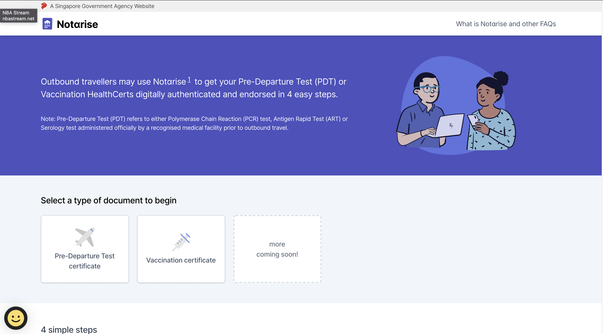
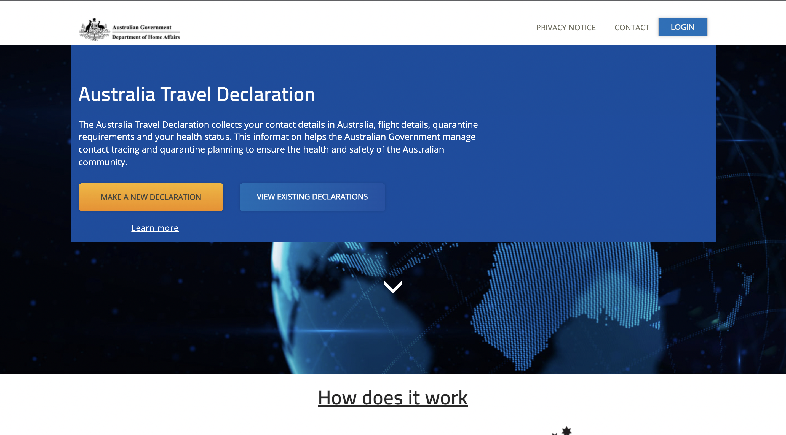
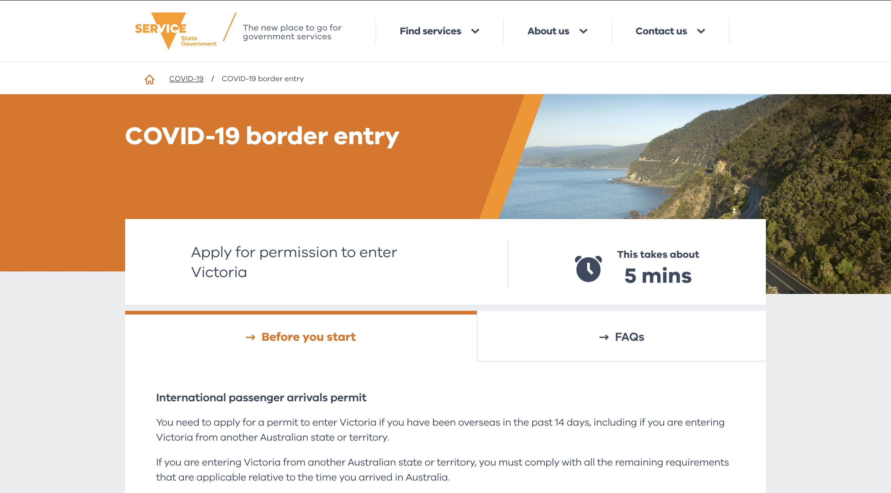
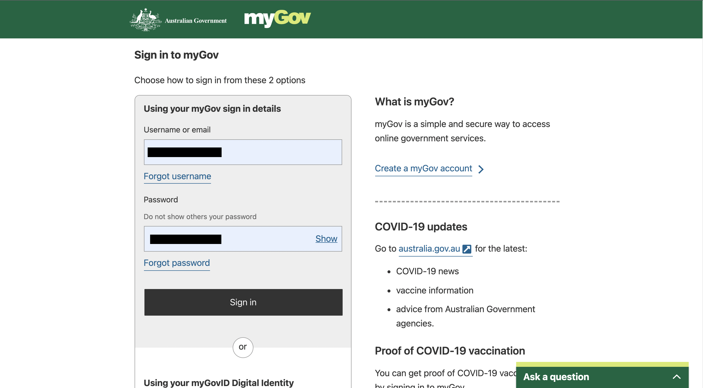

```{r setup, include=FALSE}
knitr::opts_chunk$set(echo = FALSE)
```
> Note: This is based on my experience and may not reflect what occurs during your trip. Quarantine/isolation and testing requirements do change based on the COVID situation and it is advised that you check the [Victorian Government website](https://www.coronavirus.vic.gov.au/information-overseas-travellers#travellers-from-other-countries-who-are-fully-vaccinated) for the latest updates before your flight.

## Pre-Departure
In order to utilize the VTL there were several documents which needed to be prepared. I recommended that you print these documents out.

* Vaccination Certificate
  + Available for download via the [Notarise Website](https://www.notarise.gov.sg/).
<center>
{width=70% .external}
</center>

* [Australian Travel Declaration](https://atd.homeaffairs.gov.au/)
  + Required to be completed *at least 72 hours* before departure.
<center>
{width=70% .external}
</center>

* [International Passenger Arrival Permit](https://www.service.vic.gov.au/services/border-permit/home)
  + Arrivals into Victoria require an arrival permit.
<center>
{width=70% .external}
</center>

* Negative PCR Test
  + Taken within *72 hours* of your flight. You can book an appointment at any [MOH-Approved Covid 19 Test Providers](https://www.moh.gov.sg/licensing-and-regulation/regulations-guidelines-and-circulars/details/list-of-covid-19-swab-providers)
  

When checking in our luggage at Changi Aiport we were asked to show physical proof of our vaccine certificate and the negative pre-departure PCR test. Afterwards everything during the transit to Melbourne occured as per usual.

<center>
{width=35% .external}
</center>

## Arrival
Within 24 hours of arrival we were required to either take a PCR or take a RAT (Rapid Antigen Test) test and isolate until we returned a negative result.

Another PCR/RAT test was required to be taken between days 5 and 7 of arrival.

**Again these were the quarantine arrangements during my trip (02/01/2022) and might not be up to date. Do check the [Victorian Government website](https://www.coronavirus.vic.gov.au/information-overseas-travellers#travellers-from-other-countries-who-are-fully-vaccinated) for up to date information before your flight.**

#### RAT/ART (Rapit Antigen Test)
Currently RAT kits are sold out in all chemists and pharmacists in Melbourne. I would highly recommend bringing your own kits from Singapore in order to avoid the hassle. 

<center>
{width=25% .external}
</center>

#### PCR Testing
While PCR tests in Melbourne are free the current surge of omicron has resulted in large waves of people lining outside testing sites waiting to get tested. It takes 3-4 hours of waiting in line before even setting foot inside the testing center. 

<center>
{width=35% .external}
{width=35% .external}
</center>
If you are required to take a PCR Test my suggestion would be to queue up at your nearest [testing site](https://www.coronavirus.vic.gov.au/where-get-tested-covid-19) before open hours.

The last thing that needs to be done after arriving is setting up the Service Victoria App.

### Service Victoria App
::: {.floatting}
```{r out.width='25%', out.extra='style="float:right; padding:10px"'}

```
Melbourne's TraceTogether App. It allows you to check in at stores and acts as proof of your vaccination status. In order to set it up you need to have your vaccine certificate uploaded.

:::
<center>
{width=85% .external}
</center>

#### IHI/myGov
As international students we don't have access to Medicare so we had to upload our COVID-19 certificates using the [Individual Healthcare Identifier (IHI)](https://www.servicesaustralia.gov.au/individual-healthcare-identifiers).

The quickest way to get an IHI is online through your [myGov](https://my.gov.au/LoginServices/main/login?execution=e3s1) account. If you don’t have an account, it’s easy to [create one](https://www.servicesaustralia.gov.au/mygov-help-create-mygov-account).

<center>
{width=70% .external}
</center>

After creating your myGov account follow these steps to get an IHI online:

1. Sign in to myGov
2. Select services or link your first service.
3. Select IHI service from the list
4. Follow the prompts to get your IHI, and link the service.

#### Uploading your vaccine certificate
After getting our IHI we needed to find a pharmacist/chemist/GP who was able to upload our Vaccination Certificates onto the IHI. 

Any place which does vaccinations should be able to upload the certificates. For us we chose to go to the Chemist Warehouse on Elizabeth Street where we paid a $10 service fee for the upload.

We were required to present:

* Our passports
* The vaccination certificates
* Personal IHI numbers

{width=100% .external}

After the certificates were uploaded we were then able to add our digital certificates to the Service Victoria App. 

1. Log onto your myGov account using a browser on your phone

2. Select the ‘Individual Healthcare Identifiers’ service
<center>
{width=70% .external}
</center>
3. Select ‘View immunisation history’ on the ‘Immunisation history’ tile.
<center>
{width=35% .external}
</center>
4. Tap ‘Share with check-in app’.
<center>
{width=35% .external}
</center>
5. Tap 'Service Victoria'
<center>
{width=35% .external}
</center>
Check out the full steps [here](https://service.vic.gov.au/covid-19/add-covid-19-digital-certificate?channel=mobileapplication)

After uploading the vaccine certificates our vaccination status would now be shown whenever we checked into a venue. We were finally be able to leave our passports and physical vaccine certificates at home :) 


<center>
Thanks so much for reading til the end. I hope this guide is able to help in your preparation to return to Melbourne and I look forward to meeting many of you on campus!
</center>